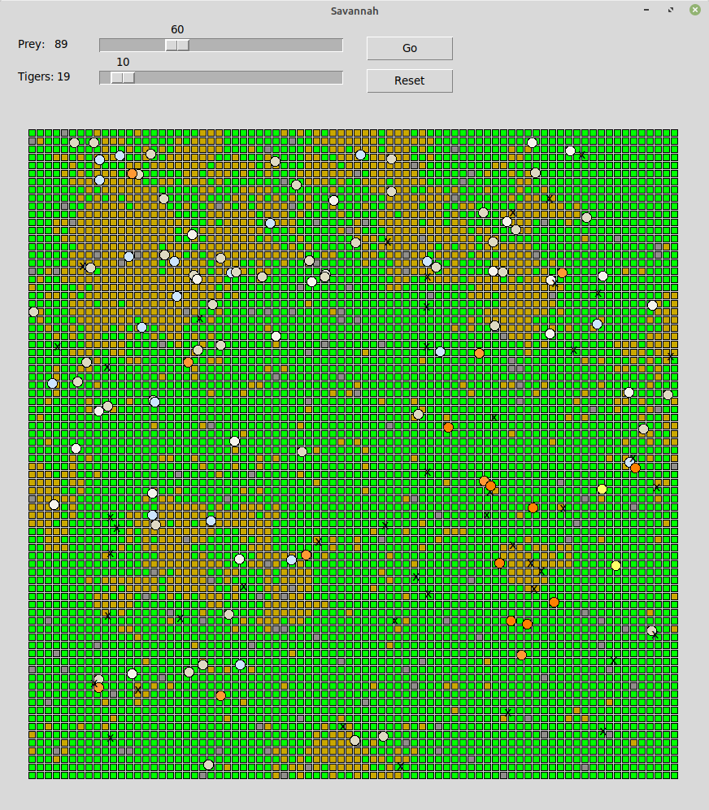
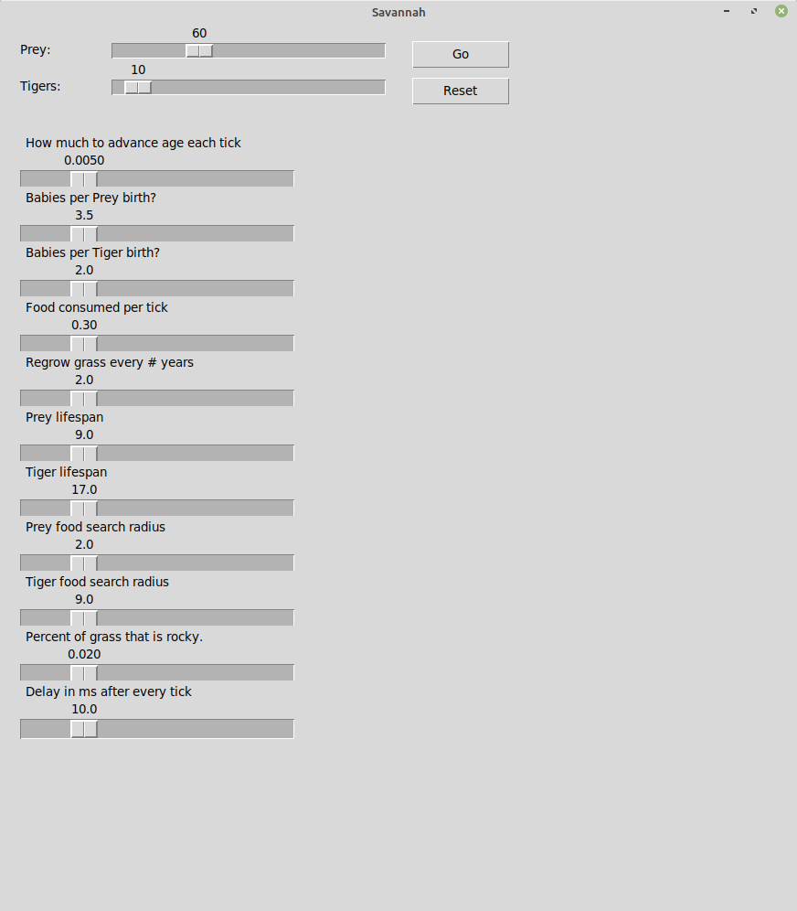

### Requirements:
  * Mesa: `sudo python3 m pip install mesa`
  * tkinter: `sudo apt install python3-tk`

This is an example of an Agent based model for a Predator/Prey simulation using Mesa and
Tkinter for the graphical display.

In addition to simulating a savannah environment with green grass cells that are eaten and regrow, it also simulates Male/Female tigers (Orange/Dark Orange) that mate to make more Tigers and Male/Female prey (Blue/Light Blue) that mate to make more prey.

To mate two animals must be in proximity to each other and at the right stage of their lifespan. For a Tiger to catch prey it must give chase and get close enough to pounce. For a Prey to eat a grass Patch it must be on top of it. All of the variables controlling this are adjustable with sliders. For the simulation to continue, the number of predators, prey and available grass cells must remain eternally in balance.

It's up to the user to find a natural balance that will let the Savannah thrive for many generations.

### Screenshots:

### Usage:

Run ./savannah.py
